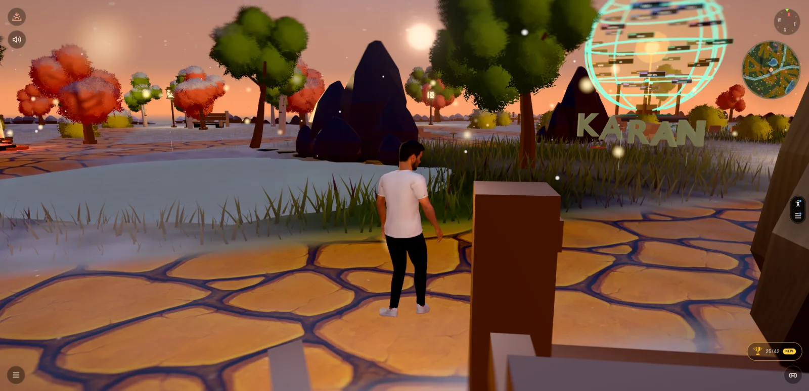

# Karan's World — Interactive 3D Portfolio

A Bruno Simon–style walkable 3D portfolio. Spawn on a small island and wander
toward the four cardinal directions to discover projects, skills, experience,
and contact details — with mini-games, achievements, and a magical resume book
hidden along the way.

<p align="center">
  
</p>

**Live:** <https://world.karanmahajan.ca/>

> Built with vanilla Three.js (WebGPU + TSL) + Rapier physics + Vite. No React,
> no framework.

---

## Features

- **Third-person walkable world** with a custom Avaturn character rigged to
  Mixamo animations (idle, walk, run, jump, push, backflip, cartwheel).
- **WebGPU rendering** via Three.js `WebGPURenderer` and TSL node materials,
  with a graceful fallback path for unsupported browsers.
- **Rapier 3D physics** — kinematic character controller, heightfield ground,
  and dynamic props you can shove around.
- **Four portfolio zones** keyed off cardinal directions on the island:
  - **East** — Projects, a cycling Project Showcase screen (+ projects hut)
  - **North** — Experience, a trail of signs you walk past
  - **South** — Skills, interactive skill spheres
  - **West** — Contact links
- **Floating magical resume book** — open it (E) for a turn.js-style
  drag-to-flip reading view of the real resume.
- **Mini-games** — the Colour Garden paint-throw game mode and a shoreline
  distance-guessing game.
- **42 achievements** with rarity tiers, a cinematic unlock toast, and a
  trophy-hall panel (J), persisted to local storage.
- **Map system** — a parchment mini-map that expands to a full overlay (M),
  marker-click iris-wipe teleports, and land-click auto-walk.
- **Day / night cycle** with a togglable sun, lamp posts that light at dusk,
  and a weather director (rain, thunderstorm, snow).
- **Atmosphere** — sunset gradient sky, drifting fireflies, GPU-instanced
  grass and foliage, reflective ocean and ponds, a lava hazard, and tinted
  fog that fades distant geometry into the horizon.
- **Audio** — ambient loop, footsteps that follow gait, UI chimes, and water
  splashes (Howler).
- **Loading screen → welcome compass → journey** flow, with a session-storage
  flag that skips the welcome on reload.
- **Mobile-aware UI** — touch joystick, controls HUD, and interaction prompts.

## Controls

| Key             | Action                   |
| --------------- | ------------------------ |
| `W` `A` `S` `D` | Move                     |
| `Shift`         | Run                      |
| `Space`         | Jump                     |
| `Z`             | Crouch                   |
| `E`             | Interact / act on prompt |
| `P` (hold)      | Push prop                |
| `B`             | Backflip                 |
| `C`             | Cartwheel                |
| `M`             | Open map                 |
| `J`             | Open achievements panel  |
| `Esc`           | Close modal / back       |
| Mouse drag      | Look around              |

## Tech stack

- **[three](https://threejs.org/) 0.184** — `WebGPURenderer`, scene, lights,
  TSL node materials
- **[@dimforge/rapier3d-compat](https://rapier.rs/) 0.19** — physics (async WASM init)
- **[camera-controls](https://github.com/yomotsu/camera-controls) 3** — smoothed third-person follow cam
- **[gsap](https://greensock.com/gsap/) 3** — UI fades + interaction transitions
- **[page-flip](https://nodlik.github.io/StPageFlip/) 2** — resume book page turns
- **[howler](https://howlerjs.com/) 2** — audio playback
- **[@vercel/speed-insights](https://vercel.com/docs/speed-insights) 2** — perf telemetry
- **[vite](https://vitejs.dev/) 8** — dev server & bundler (`publicDir: 'static'`)

## Getting started

Requires Node 18+ and a WebGPU-capable browser (recent Chrome, Edge, or Safari).

```bash
npm install
npm run dev            # http://localhost:5173
npm run build          # production build → dist/
npm run preview        # preview the built bundle
npm run compress:world # Draco-compress the world GLBs (after a Blender re-export)
```

Static assets (GLB / FBX / textures / HDR / audio) live under `static/` and are
served as-is by Vite. The Blender-authored world ships as compressed GLBs in
`static/world/`.

## Project structure

```
index.html              loading screen, welcome overlay, controls HUD, SEO/GTM
src/main.js             bootstrap: load → welcome → start journey
src/App.js              renderer, scene, lights, tick loop, module wiring
src/style.css           overlays, HUD, sign tooltips, modal styles

src/Utils/              Sizes, Loader (GLTF/FBX/Texture), Debug, Quality tiers
src/Materials/          SmoothLitPaletteMaterial (shared TSL node material)
src/Physics/            Rapier init + heightfield ground + collider helpers
src/Player/             Player, PlayerController (input), PlayerCamera, Character
src/World/              GlbV3World, Terrain/Sky/Sun, TimeOfDay, WeatherDirector,
                        Grass, Foliage, Flowers, Lava, Bonfires, Lights, World
src/Portfolio/          ProjectShowcase, ProjectsHut, Experience, SkillSphere,
                        ContactBoard, ResumeBook, ColourGarden, Interactables,
                        Interaction, ActionPrompts, *Data.js
src/Effects/            Fireflies, Water, Rain, Snow, Thunderstorm, Leaves,
                        Footprints, WindLines, PostFX
src/UI/                 Compass, MiniMap, MapOverlay, Tutorial, Achievement*,
                        Discovery, ResumeBookView, UIController (mobile)
src/Travel/             ClickToMove, IntroCinematic, Navmask (A*), Teleport, TransitionFX
src/Systems/            Achievements, ControlHints, DistanceGame, LavaHazard
src/Audio/              AudioManager (ambient + footsteps + chimes + splashes)

static/models/          character/ nature/ props/ wildlife/ extras/ …
static/textures/        ground, water, props
static/sounds/          ambient + sfx
static/world/           Draco-compressed Blender world GLBs
```

## World layout

- Spawn at `(0, 0.02, 0)`, facing north `+Z`.
- Walkable perimeter is roughly `r ≈ 60m`; the terrain mesh spans `±96.85m` and
  the ocean plane `±105m`. Cardinal sections sit at `±52.15m`.
- Props are placed on the terrain heightfield — always sample
  `terrain.heightAt(x, z)` for both the mesh and its physics collider, never a
  hardcoded `y`.
- `Nature.addExclusion(x, z, r)` keeps trees out of clearings — call it for
  every new section so vegetation doesn't clip props.

## Tick loop

```
physics.step → player.update → playerCamera.update → discovery.update
→ clickToMove → miniMap → mapOverlay → compass → world.update → wind
→ grass.setPlayerPos → actionPrompts → interaction → interactables → ui (mobile)
→ fireflies → water → rain → thunderstorm → windLines → leaves → footprints
→ audio.tick → achievements.tick → distanceGame → sun + shadow follow player
→ timeOfDay.tick → streetLights → water.preRender → postfx.render
```

The sun and the shadow camera follow the player so shadows stay sharp wherever
you wander.

## Asset credits

- **Character** — [Avaturn](https://avaturn.me/) (custom avatar export)
- **Animations** — [Mixamo](https://www.mixamo.com/) (retargeted onto the Avaturn rig)
- **World** — hand-built in Blender, exported as Draco-compressed GLBs
- **Nature / prop kits** — [Kenney.nl](https://kenney.nl/)
- **HDR / sky / material maps** — [Poly Haven](https://polyhaven.com/) and
  CC-BY sources (see in-repo `CREDITS.md` files where applicable)

If you fork this and ship it, swap in your own art before publishing.

## License

MIT — see [package.json](package.json). The code is MIT; third-party assets
under `static/` keep their original licenses (Kenney is CC0; Mixamo/Avaturn
require an account but are royalty-free for personal portfolios).
</content>
</invoke>
