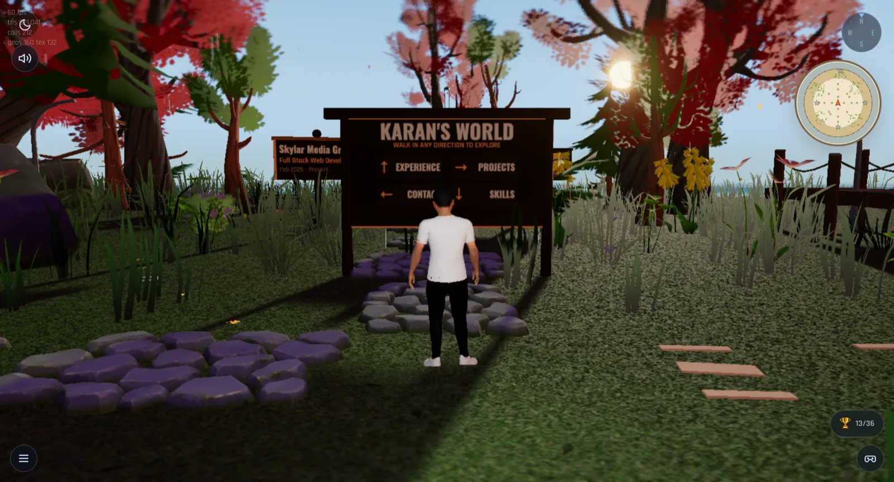
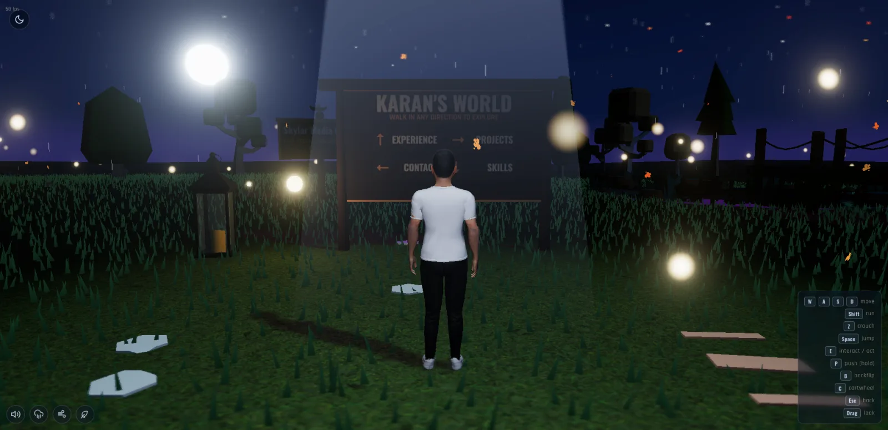

# Karan's World — Interactive 3D Portfolio

A Bruno Simon–style walkable 3D portfolio. Spawn in a small open world and
wander toward the four cardinal directions to discover projects, skills,
experience, and contact details.

<p align="center">
  
  
</p>

**Live:** <https://world.karanmahajan.ca/>

> Built with vanilla Three.js + Rapier physics + Vite. No React, no framework.

---

## Features

- **Third-person walkable world** with a custom Avaturn character rigged to
  Mixamo animations (idle, walk, run, jump, push, backflip, cartwheel).
- **Rapier 3D physics** — kinematic character controller, static ground, and
  dynamic props you can shove around.
- **Four portfolio "zones"** keyed off cardinal directions:
  - **East** — Projects, presented as interactive billboards
  - **North** — Experience, a trail of signs you walk past
  - **South** — Skills
  - **West** — Contact links
- **Day / night cycle** with a togglable sun, lamp posts that switch on at
  dusk, and tinted fog that fades distant geometry into the horizon.
- **Atmosphere** — sunset gradient sky, drifting birds, ambient fireflies, a
  reflective pond with lily pads NW of spawn, and optional rain.
- **PostFX pipeline** (bloom + vignette via `EffectComposer`).
- **Audio** — ambient loop, footsteps that follow gait, and UI chimes (Howler).
- **Loading screen → welcome compass → journey** flow, with a session-storage
  flag that skips the welcome on reload.
- **Mobile-aware UI**: controls HUD, day/night button, and interaction prompts.

## Controls

| Key | Action |
|---|---|
| `W` `A` `S` `D` | Move |
| `Shift` | Run |
| `Z` | Crouch |
| `Space` | Jump |
| `E` | Interact / act on prompt |
| `P` (hold) | Push prop |
| `B` | Backflip |
| `C` | Cartwheel |
| `Esc` | Close modal / back |
| Mouse drag | Look around |

## Tech stack

- **[three](https://threejs.org/) 0.184** — renderer, scene, lights, materials
- **[@dimforge/rapier3d-compat](https://rapier.rs/) 0.12** — physics (async WASM init)
- **[camera-controls](https://github.com/yomotsu/camera-controls) 3** — smoothed third-person follow cam
- **[gsap](https://greensock.com/gsap/) 3** — UI fades + interaction transitions
- **[howler](https://howlerjs.com/) 2** — audio playback
- **[vite](https://vitejs.dev/) 8** — dev server & bundler (`publicDir: 'static'`)

## Getting started

Requires Node 18+.

```bash
npm install
npm run dev      # http://localhost:5173
npm run build    # production build → dist/
npm run preview  # preview the built bundle
```

Static assets (GLB / FBX / textures / HDR / audio) live under `static/` and
are served as-is by Vite.

## Project structure

```
index.html              loading screen, welcome overlay, controls HUD
src/main.js             bootstrap: load → welcome → start journey
src/App.js              renderer, scene, lights, tick loop, module wiring
src/style.css           overlays, HUD, sign tooltips, modal styles

src/Utils/              Sizes, Loader (GLTF/FBX/Texture), Debug HUD
src/Physics/            Rapier init + world step + colliders
src/Player/             Player, Controller (input), Camera, Character (FBX clips)
src/World/              Terrain, Sky, Nature, Birds, TimeOfDay, Grass, World
src/Portfolio/          Billboards, Signs, Furniture, Interaction, *Data.js
src/Effects/            Fireflies, Water, Rain, PostFX
src/Audio/              AudioManager (ambient + footsteps + chimes)

static/models/          character/ nature/ furniture/ wildlife/ extras/ …
static/textures/        ground, water, props
static/sounds/          ambient + sfx
```

## World layout

- Spawn at `(0, 0, 0)`, facing north `+Z`.
- Section centers sit roughly 35 units from spawn in each cardinal direction.
- The pond is at `(-12, 0.05, 18)`, radius 5.5.
- `Nature.addExclusion(x, z, r)` keeps trees out of clearings — call it for
  every new section so vegetation doesn't clip props.

## Tick loop

```
physics.step → player.update → playerCamera.update → world.update
            → interaction.tick → fireflies → water → rain
            → audio.tick → postfx.render
```

The sun and the shadow camera follow the player so shadows stay sharp wherever
you wander.

## Asset credits

- **Character** — [Avaturn](https://avaturn.me/) (custom avatar export)
- **Animations** — [Mixamo](https://www.mixamo.com/) (retargeted onto Avaturn rig)
- **Nature / furniture kits** — [Kenney.nl](https://kenney.nl/)
- **HDR / sky textures** — [Poly Haven](https://polyhaven.com/) where applicable

If you fork this and ship it, swap in your own art before publishing.

## License

MIT — see [package.json](package.json). The code is MIT; third-party assets
under `static/` keep their original licenses (Kenney is CC0; Mixamo/Avaturn
require an account but are royalty-free for personal portfolios).
